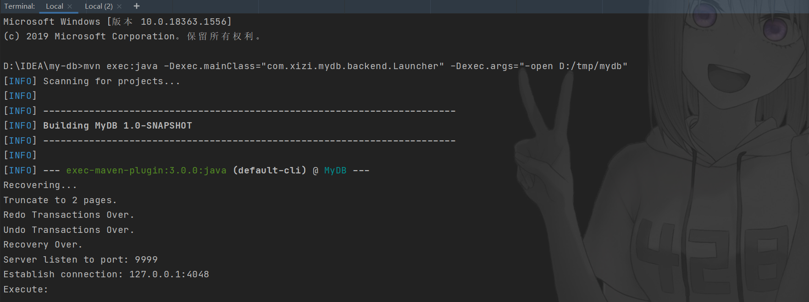

# MIT-DB

基于 GoLand 完成的 Labs of MIT DB: Distributed Systems.
<!-- PROJECT SHIELDS -->

[![Contributors][contributors-shield]][contributors-url]
[![Forks][forks-shield]][forks-url]
[![Stargazers][stars-shield]][stars-url]
[![MIT License][license-shield]][license-url]


<!-- PROJECT LOGO -->
<br />

<p align="center">
    <a href="https://github.com/hakusai22/DB/">
    
    </a>
    <h3 align="center">Java实现数据库</h3>
  <p align="center">
    ·
    <a href="https://github.com/hakusai22/DB/issues">报告Bug</a>
    ·
    <a href="https://github.com/hakusai22/DB/issues">提出新特性</a>
  </p>

<!-- links -->
[your-project-path]:hakusai22/DB
[contributors-shield]: https://img.shields.io/github/contributors/hakusai22/DB.svg?style=for-the-badge
[contributors-url]: https://github.com/hakusai22/DB/graphs/contributors
[forks-shield]: https://img.shields.io/github/forks/hakusai22/DB.svg?style=for-the-badge
[forks-url]: https://github.com/hakusai22/DB/network/members
[stars-shield]: https://img.shields.io/github/stars/hakusai22/DB.svg?style=for-the-badge
[stars-url]: https://github.com/hakusai22/DB/stargazers
[issues-shield]: https://img.shields.io/github/issues/hakusai22/DB.svg?style=for-the-badge
[issues-url]: https://img.shields.io/github/issues/hakusai22/DB.svg
[license-shield]: https://img.shields.io/github/license/hakusai22/DB.svg?style=for-the-badge
[license-url]: https://github.com/hakusai22/DB/blob/master/LICENSE
[linkedin-shield]: https://img.shields.io/badge/-LinkedIn-black.svg?style=for-the-badge&logo=linkedin&colorB=555
[linkedin-url]: https://linkedin.com/in/xxxx

### Lab 1 MapReduce

### Lab 2 Raft

### Lab 3 Fault-tolerant Key/Value Service

### Lab 4 Sharded Key/Value Service


MYDB 是一个 Java 实现的简单的数据库，部分原理参照自 MySQL、PostgreSQL 和 SQLite。实现了以下功能：

- 数据的可靠性和数据恢复
- 两段锁协议（2PL）实现可串行化调度
- MVCC
- 两种事务隔离级别（读提交和可重复读）
- 死锁处理
- 简单的表和字段管理
- 简陋的 SQL 解析（因为懒得写词法分析和自动机，就弄得比较简陋）
- 基于 socket 的 server 和 client

## 运行方式

首先执行以下命令以 /tmp/mydb 作为路径创建数据库：

```shell
mvn exec:java -Dexec.mainClass="Launcher" -Dexec.args="-create D:/tmp/mydb"
```

随后通过以下命令以默认参数启动数据库服务：

```shell
mvn exec:java -Dexec.mainClass="Launcher" -Dexec.args="-open D:/tmp/mydb"
```



这时数据库服务就已经启动在本机的 9999 端口。重新启动一个终端，执行以下命令启动客户端连接数据库：

```shell
mvn exec:java -Dexec.mainClass="Launcher"
```

会启动一个交互式命令行，就可以在这里输入类 SQL 语法，回车会发送语句到服务，并输出执行的结果。

一个执行示例：

